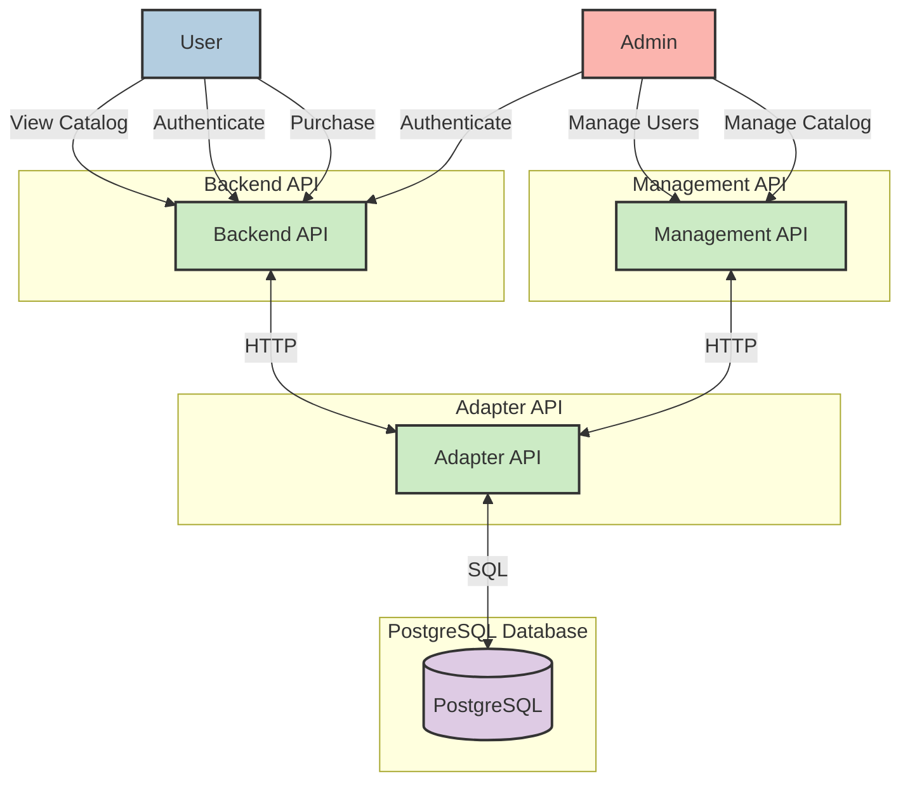

# E-commerce System (Test Store API)

A microservices-based e-commerce system with separate APIs for storefront, management, and data access layers. This is purely for testing purposes only!

## System Architecture
The system consists of three main APIs and a PostgreSQL database.



1. **Backend API** (Port 3000)
   - Customer-facing storefront API
   - Handles login, product browsing, cart management, and checkout
   - Authentication required for cart/checkout operations

2. **Management API** (Port 3500)
   - Admin-only API for system management
   - Handles user and product management
   - Requires admin authentication

3. **Adapter API** (Internal)
   - Data access layer
   - Manages direct database interactions
   - Handles data validation and persistence
   - Not externally exposed - internal service only

4. **PostgreSQL Database** (Port 5432)
   - Stores product catalog and user data
   - Persistent volume for data storage

## Features

- Product catalog management
- User management (admin/customer roles)
- Shopping cart functionality
- Dynamic token-based authentication
- Swagger API documentation for Backend and Management services
- Data seeding with realistic product data
- Docker containerization
- Microservices architecture

## Prerequisites

- Docker
- Docker Compose
- Node.js (for development)
- npm (for development)

## Quick Start

1. Clone the repository:
```bash
git clone https://github.com/JMelon/TestStoreApi.git
```

2. Remove containers if they exist (optional):
```bash
docker compose down -v
```

3. Start the services:
```bash
docker compose up --build
```

3. Access the APIs:
- Backend API: http://localhost:3000
- Management API: http://localhost:3500

Note: The Adapter API (Port 4000) is only accessible internally within the Docker network and is not exposed to the host machine.

To quickly start testing, you can use the following users:
| ID | Username  | First Name | Last Name | Role  | Password  |
|----|-----------|------------|-----------|-------|-----------|
| 1  | jdoe123   | John       | Doe       | admin | jdoe@123  |
| 2  | asmith456 | Alice      | Smith     | user  | asmith@456|

## API Documentation

Each public service provides Swagger documentation at `/api-docs`:

- Backend API: http://localhost:3000/api-docs
- Management API: http://localhost:3500/api-docs

## Authentication

The system uses dynamic token-based authentication:
- Tokens are generated based on username and current date
- Different authentication requirements for customer vs admin endpoints
- Admin authentication required for Management API
- Customer authentication required for cart/checkout operations

## Database

The PostgreSQL database includes two main tables:
- `items`: Product catalog
- `users`: User accounts and roles

Data is automatically seeded on first startup with:
- 20,000 product items
- 25 sample user accounts (1 admin, 24 customers)

## Environment Variables

Key environment variables:
- `ADAPTER_API_URL`: URL for the Adapter API
- `TOKEN_SECRET`: Secret key for token generation
- `PGHOST`, `PGUSER`, `PGPASSWORD`, `PGDATABASE`, `PGPORT`: PostgreSQL connection details

## Docker Support

Each service includes a Dockerfile and the entire system can be deployed using docker-compose

## Catalog data generator (optional)

A utility script that generates realistic product data for the catalog. Uses Faker.js to create items with randomized names, descriptions and prices. The generated data is saved as JSON and can be used to seed the database. Example output:

```json
[
    {
        "id": 4,
        "name": "Sleek Granite Car",
        "description": "New ergonomic design for comfort",
        "price": "402.89"
    },
    {
        "id": 5,
        "name": "Ergonomic Aluminum Pants",
        "description": "Experience the cyan brilliance of our Pants, perfect for moral environments",
        "price": "295.09"
    }
]
```


#### Generate catalog data:
```bash
cd catalog-data-generator
npm install
node generateCatalog.js
```

## Possible Test Ideas

### Authentication Tests
1. Valid user login returns correct token
2. Invalid credentials return 401
3. Admin access with non-admin token returns 403
4. Expired token returns 401
5. Missing token returns 401

### Product Catalog Tests
1. Get products returns paginated results
2. Product listing returns all available products
3. Single product retrieval returns correct data
4. Invalid product ID returns 404
5. Product list respects page size limits

### Shopping Cart Tests
1. Add item to cart succeeds with valid token
2. Add invalid item ID returns 404
3. Cart data is stored temporarily in memory
4. Checkout empty cart returns error
5. Checkout with valid items succeeds
6. Checkout with invalid token returns 401
7. Checkout with expired token returns 401
8. Checkout without adding to cart returns error
9. Get items in cart returns correct list of items previously added to cart
10. Users can't see items in other users carts
11. Items can be deleted from cart
12. Delete non-existent item from cart returns 400
13. Payment can't be completed without checkout first

### Admin Management Tests
1. Admin can create new product
2. Admin can update product details
3. Admin can create new user
4. Admin can modify user roles
5. Batch product creation works

### Data Validation Tests
1. Product price must be positive
2. Product name cannot be empty
3. User password is not empty
4. Username must be unique
5. Invalid role assignment fails

### Error Handling
1. Database connection failure handled gracefully
2. Invalid JSON request returns 400
3. Internal server errors return 500
4. Missing required fields return 400
5. Malformed tokens return 401

### End-to-End Tests
1. User registration to purchase flow
2. Admin product creation to customer view
3. Price updates reflect in catalog
4. User role changes affect permissions

### Performance Tests
1. Catalog pagination under load
2. Concurrent cart operations
3. Multiple admin updates
4. Product listing response times
5. Backend authentication latency
6. End-to-end order flow under load